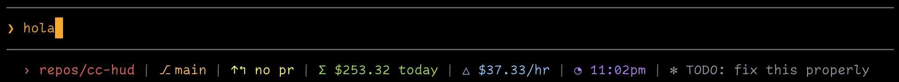

# cc-hud

A toolkit for monitoring Claude Code sessions: a customizable statusline with live usage tracking, and a native macOS menu bar app to see all active sessions at a glance.

---

## Quick Start

```bash
git clone https://github.com/yourusername/cc-hud.git
cd cc-hud
just install
```

This installs both components. To install individually:

```bash
just install statusline   # statusline only
just install menubar      # menu bar app only
```

---

## Statusline



A customizable status bar for Claude Code with live cost tracking, EWMA pace calculation, and powerline styling.

### Features

- **Live daily totals** - Accurate cost tracking (Claude Code + Codex CLI)
- **EWMA pace calculation** - Smoothed hourly burn rate with configurable half-life
- **7 segment types** - Usage, pace, directory, git, PR, time, and thoughts
- **Light/dark theme** - Auto-detects system theme or set manually
- **Full customization** - Colors, segments, separator styles

### Requirements

- Bun 1.0+ (included with Claude Code)
- Claude Code
- Optional: `gh` CLI for PR segment

### Installation

```bash
just install statusline
```

Then configure Claude Code by adding to `~/.claude/settings.json`:

```json
{
  "statusLine": {
    "type": "command",
    "command": "bun /path/to/cc-hud/apps/statusline/src/index.ts"
  }
}
```

Replace `/path/to/cc-hud` with your clone location.

### Quick Configuration

cc-hud works out of the box. To customize, create `~/.claude/cc-hud.json`:

```json
{
  "theme": {
    "colorMode": "text",
    "themeMode": "auto"
  }
}
```

For full configuration options including all segments, colors, and themes, see [CONFIGURATION.md](docs/CONFIGURATION.md).

---

## Menu Bar App (macOS)

<!-- TODO: Add menu bar screenshot -->


A native macOS app that displays all active Claude Code sessions in your menu bar.

### Features

- **See all sessions** - Monitor 3-5+ concurrent Claude Code sessions
- **Status indicators** - Green (waiting for input), Yellow (working)
- **Session metadata** - Project name, path, git branch, time since last activity
- **Real-time updates** - Via Claude Code hooks

### Requirements

- macOS 14.0+
- Xcode 15+ (for building)
- jq: `brew install jq`

### Installation

```bash
just install menubar
```

This builds the app, installs it to `/Applications`, and launches it.

### Launch at Login

To start the menu bar app automatically:

1. Open **System Settings → General → Login Items**
2. Click **+** under "Open at Login"
3. Select **CCMenubar.app** from Applications

### Configuring Hooks

The menu bar app uses Claude Code hooks to track sessions. Add to your `~/.claude/settings.json`:

```json
{
  "hooks": {
    "SessionStart": [
      {
        "hooks": [
          {
            "type": "command",
            "command": "/path/to/cc-hud/hooks/session-start.sh"
          }
        ]
      }
    ],
    "UserPromptSubmit": [
      {
        "hooks": [
          {
            "type": "command",
            "command": "/path/to/cc-hud/hooks/prompt-submit.sh"
          }
        ]
      }
    ],
    "Notification": [
      {
        "matcher": "idle_prompt",
        "hooks": [
          {
            "type": "command",
            "command": "/path/to/cc-hud/hooks/session-update.sh"
          }
        ]
      }
    ],
    "Stop": [
      {
        "hooks": [
          {
            "type": "command",
            "command": "/path/to/cc-hud/hooks/session-end.sh"
          }
        ]
      }
    ]
  }
}
```

**Setup checklist:**

- [ ] Replace `/path/to/cc-hud` with your actual clone location
- [ ] Merge into existing settings (don't replace the whole file)
- [ ] Install jq: `brew install jq`
- [ ] Make hooks executable: `chmod +x /path/to/cc-hud/hooks/*.sh`

**What each hook does:**

| Hook | Trigger | Action |
|------|---------|--------|
| `SessionStart` | Session starts | Registers session as "working" (yellow) |
| `UserPromptSubmit` | User sends a message | Updates to "working" (yellow) |
| `Notification` | Claude waiting for input | Updates to "waiting" (green) |
| `Stop` | Session ends | Removes from menu bar |

---

## Development

After making changes, reinstall the updated component:

```bash
just install menubar      # rebuilds, reinstalls, relaunches
just install statusline   # reinstalls dependencies
```

---

## Troubleshooting

### Statusline not showing

1. **Check the path** - Verify the path in `settings.json` points to the correct location:
   ```bash
   ls /path/to/cc-hud/apps/statusline/src/index.ts
   ```

2. **Test manually** - Run the statusline directly:
   ```bash
   echo '{}' | bun /path/to/cc-hud/apps/statusline/src/index.ts
   ```

3. **Check for errors** - Look at Claude Code's output for error messages

### Menu bar app shows "No active sessions"

1. **Hooks not configured** - Verify hooks are in your settings:
   ```bash
   cat ~/.claude/settings.json | jq '.hooks'
   ```

2. **Hooks not executable** - Fix permissions:
   ```bash
   chmod +x /path/to/cc-hud/hooks/*.sh
   ```

3. **jq not installed** - Install it:
   ```bash
   brew install jq
   ```

4. **Test hooks manually**:
   ```bash
   export CLAUDE_SESSION_ID="test-123"
   export CLAUDE_WORKING_DIRECTORY="$(pwd)"
   /path/to/cc-hud/hooks/session-start.sh

   # Check database
   sqlite3 ~/.claude/statusline-usage.db "SELECT * FROM hud_sessions;"

   # Clean up
   sqlite3 ~/.claude/statusline-usage.db "DELETE FROM hud_sessions WHERE session_id='test-123';"
   ```

5. **Click Refresh** - The menu bar app may need a manual refresh

### Menu bar app not receiving real-time updates

The app listens on `localhost:19222`. If updates aren't instant:

1. **Check if server is running**:
   ```bash
   lsof -i :19222
   ```

2. **Test HTTP endpoint**:
   ```bash
   curl -X POST http://localhost:19222/session-update \
     -H "Content-Type: application/json" \
     -d '{"event":"update","session_id":"test","cwd":"/tmp","status":"waiting"}'
   ```

3. **Restart the app** - Quit and relaunch CCMenubar

### Database errors

If you see SQLite errors:

1. **Check database exists**:
   ```bash
   ls -la ~/.claude/statusline-usage.db
   ```

2. **Verify schema**:
   ```bash
   sqlite3 ~/.claude/statusline-usage.db ".schema hud_sessions"
   ```

3. **Reset database** (loses session history):
   ```bash
   rm ~/.claude/statusline-usage.db
   # Restart Claude Code - it will recreate the database
   ```

---

## Documentation

- [Configuration Guide](docs/CONFIGURATION.md) - Full statusline configuration options
- [Architecture](docs/ARCHITECTURE.md) - Technical implementation details
- [Design Decisions](docs/DESIGN.md) - Why we made the choices we did

---

## License

MIT
